### Hi there 👋

- 📒 I'm interested in programming languages, DSLs, educational programming environments, Python, Android, Raspberry Pi, GNU Linux and digital archeology.
- 🔍 I'm looking for work!
- 📫 How to reach me: I am on github every day and also on <a rel="me" href="https://mastodon.gamedev.place/web/@pvm">Mastodon</a> and <a rel="me" href="https://bsky.app/profile/pvmm.bsky.social">Bluesky</a>.

 

  

 

 

